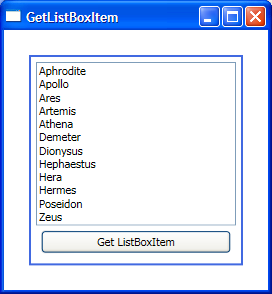

# How to get a ListBoxItem from a data bound ListBox

Data binding a list box to an enumeration of items could not be easier in WPF:

	<Window.Resources>
		<local:GreekGods x:Key="greekGods"/>
		<DataTemplate x:Key="itemTemplate">
			<TextBlock Text="{Binding Path=Name}" />
		</DataTemplate>
	</Window.Resources>
	
	<ListBox ItemsSource="{StaticResource greekGods}" ItemTemplate="{StaticResource itemTemplate}" Name="listBox"/>

The ItemsSource property of ListBox takes an IEnumerable, which is the list of items you want to display. In this case, the GreekGods data source is of type ObservableCollection, which implements IEnumerable. The ItemTemplate property specifies the DataTemplate that will be used to control how the data is displayed. In this case, we will have a TextBlock for each item that will display the GreekGod's name.

Some of you might find surprising, however, that doing listBox.Items[i] in code returns the data we're binding to, and not the TextBlock or the ListBoxItem. In my opinion, it is actually pretty cool that retrieving the data in a particular position of the list box is so easy, because most of the time this is exactly what you want. 

	GreekGod greekGod = (GreekGod)(listBox.Items[0]);

But what about when you want to have access to the actual ListBoxItem generated? This is a bit tricky to discover but can be just as easily done with the following code: 

	ListBoxItem lbi1 = (ListBoxItem)(listBox.ItemContainerGenerator.ContainerFromIndex(0));

There is also a listBox.ItemContainerGenerator.ContainerFromItem(object item) that returns the ListBoxItem given the corresponding data item. This method is frequently used, for example, to retrieve the ListBoxItem for the current item:

	ListBoxItem lbi2 = (ListBoxItem)(listBox.ItemContainerGenerator.ContainerFromItem(listBox.Items.CurrentItem));

I will talk about selection and current item in detail in some other post, but for this sample it is sufficient to know that to keep the selection and current item in sync, I set IsSynchronizedWithCurrentItem="true" in the ListBox.

