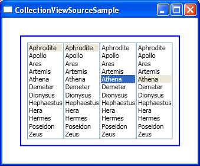

# How to sync selection of two data bound ListBoxes

I will show you two ways of syncing the selection of two data bound ListBoxes.

In the first solution, I will create a custom view over the collection and bind both ListBoxes to it. Views track the current item of their underlying collection, and allow us to sort, group and filter their items. CollectionViewSource is a new class introduced in September CTP that makes it possible to create a custom view in markup. Because the custom view created tracks the current item of the collection, and currency and selection are in sync in this scenario, binding both ListBoxes to the same view causes their selected items to be in sync.

	<Window.Resources>
		<local:GreekGods x:Key="source" />
		<CollectionViewSource Source="{StaticResource source}" x:Key="cvs"/>
	</Window.Resources>
	
	<ListBox ItemsSource="{Binding Source={StaticResource cvs}}" DisplayMemberPath="Name"/>
	<ListBox ItemsSource="{Binding Source={StaticResource cvs}}" DisplayMemberPath="Name"/>

I will write about how to use CollectionViewSource to sort, group and filter items in a future post.
An alternative way to achieve the same behavior is to set both ItemsSource properties to the data source and set the IsSynchronizedWithCurrentItem properties to true:

	<ListBox ItemsSource="{StaticResource source}" IsSynchronizedWithCurrentItem="True" DisplayMemberPath="Name"/>
	<ListBox ItemsSource="{StaticResource source}" IsSynchronizedWithCurrentItem="True" DisplayMemberPath="Name"/>

This markup works because when binding to a collection, a view is always created. If you don't specify one, a default view is created for you internally. Although this view tracks current item the same way the custom one did, when you have a default view currency and selection do not sync by default. The way to override this behavior is by setting the IsSynchronizedWithCurrentItem property to true. 

The data team made the default synchronization behavior be different for custom views and default views based on customer feedback. This way, users that are aware of the concept of view and are explicit about it get the synchronization they expect, and the rest of the users don't.

In the image below, the first and second ListBoxes are bound to the CollectionViewSource and the third and fourth ones have InSynchronizedWithCurrentItem set to true.

