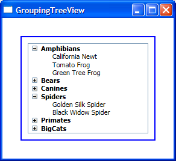

# How to display grouped data in a TreeView

The TreeView control is great at displaying structured data using the HierarchicalDataTemplate (see <a href="http://blogs.msdn.com/karstenj/archive/2005/11/02/488420.aspx">Karsten's blog post</a> on this topic). But what do you do if the data you're given is not structured hierarchically? In this post, I will show you how to create that hierarchy from a flat list of data items, using the grouping feature of data binding.

I am using the same Animal data source I used in my last post. Grouping the Animals by Category is done the same way as in my last sample:

	<local:Animals x:Key="animals"/>
	
	<CollectionViewSource x:Key="cvs" Source="{Binding Source={StaticResource animals}, Path=AnimalList}">
		<CollectionViewSource.GroupDescriptions>
			<PropertyGroupDescription PropertyName="Category"/>
		</CollectionViewSource.GroupDescriptions>
	</CollectionViewSource>

We now have the data in a hierarchical form. In this particular case it has only one level of groups, and another level with the animals. You can easily imagine that by adding more GroupDescriptions you would end up with a deeper hierarchy.

When binding to a CollectionViewSource, the Binding object knows to grab the CollectionViewSource's View property. This property returns the custom view (of type ICollectionView) that CollectionViewSource creates on top of the data collection (where the grouping is applied). In our scenario, we want to bind to the hierarchy we created with grouping, or in other words, we want to bind to the groups. We can get to this data by binding to the Groups property in ICollectionView:

	<TreeView ItemsSource="{Binding Source={StaticResource cvs}, Path=Groups}" ItemTemplate="{StaticResource categoryTemplate}" Width="200">
	</TreeView>

When using data binding's grouping feature, each group of items is wrapped in a CollectionViewGroup object. We can access the name of the group (the property we're grouping by) by using CollectionViewGroup's Name property, and we can get to the items that belong to the group through the Items property. This is all the information we need in order to make a HierarchicalDataTemplate that will display the Category of each animal and specify the animals that belong to it:

	<HierarchicalDataTemplate x:Key="categoryTemplate" ItemsSource="{Binding Path=Items}" ItemTemplate="{StaticResource animalTemplate}">
		<TextBlock Text="{Binding Path=Name}" FontWeight="Bold"/>
	</HierarchicalDataTemplate>

Finally we need a DataTemplate for the leaf nodes, which specifies how we want the Animal data to be displayed. In this case, we are interested in displaying the Name property of each Animal. Notice that the HierarchicalDataTemplate's ItemTemplate property points to this template.

	<DataTemplate x:Key="animalTemplate">
		<TextBlock Text="{Binding Path=Name}"/>
	</DataTemplate>

Here is the result of the completed sample:

