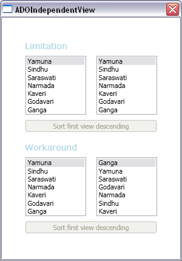

# How to get independent views of an ADO.NET source

I talked about binding to ADO.NET in an <a href="..\18-ThreeLevelMasterDetailADO">earlier blog post</a>. In that post, I explained briefly how binding to ADO.NET behaves differently from other data sources when there are 2 or more views over the source. Today I will explain this scenario in more detail and will show a workaround that makes the binding to ADO.NET behave consistently with binding to other sources.

Consider the scenario where we bind an ItemsControl to a CollectionViewSource whose Source property is set to some collection of objects. In this scenario, a CollectionView is created internally and the ItemsControl is in fact bound to this view (which the CollectionViewSource exposes through its View property). Remember that views are used to sort, filter, and group the items of a collection, as well as track the current item. Let's assume we sort this view. Now imagine we have a second ItemsControl bound to a second CollectionViewSource whose Source property is set to the same collection as previously. As you probably expect, a second view is created, independent from the first one. This means that we can sort this second view differently, without affecting the order of the items in the first view. 

This is the current behavior when the CollectionViewSource's Source is a collection of objects or XML, but not when it's an ADO.NET DataTable or DataView. When the source comes from ADO.NET, the view does not handle sorting and filtering itself; instead it delegates those operations to the DataView (if the source is a DataTable we get the corresponding DataView, if the source is a DataView we use it directly). This has the advantage of greatly increasing the performance of these operations. However, it has an important side effect in the behavior of views: they are not independent from each other. Let's consider the scenario I described above, but this time the Source property of both CollectionViewSources is set to the same DataTable. When we add a SortDescription to the CollectionViewSource, internally we get the DataView that corresponds to the DataTable and use that to sort it. Because both CollectionViewSources use the same DataTable, they will end up sorting by using the same DataView. Consequently, sorting one CollectionViewSource will affect the items displayed in both ItemsControls. 

Let's look at the come that illustrates this scenario. I started by defining an Access data source that happens to contain the names of the sacred rivers of India. I wrote a simple method that uses ADO.NET to fill a DataTable with that data, which you can see below:

	private DataTable GetData()
	{
		string mdbFile = "IndiaSacredRivers.mdb";
		string connString = string.Format("Provider=Microsoft.Jet.OLEDB.4.0; Data Source={0}", mdbFile);
		OleDbConnection conn = new OleDbConnection(connString);
	
		DataTable sacredRiversTable = new DataTable();
	
		OleDbDataAdapter sacredRiversAdapter = new OleDbDataAdapter();
		sacredRiversAdapter.SelectCommand = new OleDbCommand("SELECT * FROM SacredRivers;", conn);
		sacredRiversAdapter.Fill(sacredRiversTable);
	
		return sacredRiversTable;
	}

Then, I added the DataTable to the Window's resources, in the Window's constructor.

	public Window1()
	{
		this.Resources.Add("sacredRiversTable", this.GetData());
		InitializeComponent();
		(...)
	}

In XAML, I added two CollectionViewSources to the Window's resources and pointed their Source property to the DataTable I added to the resources before. I then added two ListBoxes and bound each of them to a CollectionViewSource:

	<Window.Resources>
		<CollectionViewSource Source="{StaticResource sacredRiversTable}" x:Key="cvs1"/>
		<CollectionViewSource Source="{StaticResource sacredRiversTable}" x:Key="cvs2"/>
		(...)
	</Window.Resources>
	
	<ListBox ItemsSource="{Binding Source={StaticResource cvs1}}" DisplayMemberPath="RiverName" (...) />
	<ListBox ItemsSource="{Binding Source={StaticResource cvs2}}" DisplayMemberPath="RiverName" (...) />

Finally, I added a Button that, when pressed, adds a SortDescription to the first CollectionViewSource.

	<Button Content="Sort first view descending" Click="SortCvs1DescendingHandler" (...) />
	
	private void SortCvs1DescendingHandler(object sender, RoutedEventArgs args)
	{
		cvs1.SortDescriptions.Clear();
		cvs1.SortDescriptions.Add(new SortDescription("RiverName", ListSortDirection.Descending));
		((Button)sender).IsEnabled = false;
	}

When you press this Button, you will notice that both ListBoxes become sorted. This is not the desired behavior - it's an unfortunate tradeoff we had to make to maximize the performance of these operations. The good news is that there is an easy workaround that will produce a behavior consistent with the other sources. If you need independent sorting, you can simply create two different DataViews, by passing the DataTable as a parameter to the constructor, and use those as your sources. This can all be done in XAML, with the help of ObjectDataProvider:

	<Window.Resources>
		<ObjectDataProvider x:Key="independentView1" ObjectType="{x:Type data:DataView}">
			<ObjectDataProvider.ConstructorParameters>
				<StaticResource ResourceKey="sacredRiversTable" />
			</ObjectDataProvider.ConstructorParameters>
		</ObjectDataProvider>
	
		<ObjectDataProvider x:Key="independentView2" ObjectType="{x:Type data:DataView}">
			<ObjectDataProvider.ConstructorParameters>
				<StaticResource ResourceKey="sacredRiversTable" />
			</ObjectDataProvider.ConstructorParameters>
		</ObjectDataProvider>
	
		<CollectionViewSource Source="{StaticResource independentView1}" x:Key="cvs3"/>
		<CollectionViewSource Source="{StaticResource independentView2}" x:Key="cvs4"/>
	
		(...)
	</Window.Resources>
	
	<ListBox ItemsSource="{Binding Source={StaticResource cvs3}}" DisplayMemberPath="RiverName" (...) />
	<ListBox ItemsSource="{Binding Source={StaticResource cvs4}}" DisplayMemberPath="RiverName" (...) />

This time, clicking the Button to sort the first view will have no effect in the order of the items of the second ListBox, as desired.

	<Button Content="Sort first view descending" Click="SortCvs3DescendingHandler" (...) />
	
	private void SortCvs3DescendingHandler(object sender, RoutedEventArgs args)
	{
		cvs3.SortDescriptions.Clear();
		cvs3.SortDescriptions.Add(new SortDescription("RiverName", ListSortDirection.Descending));
		((Button)sender).IsEnabled = false;
	}

Here is a screenshot of this application:

